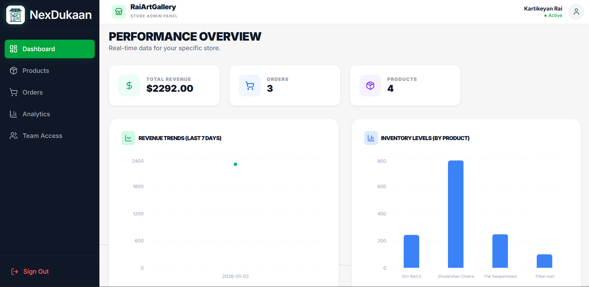
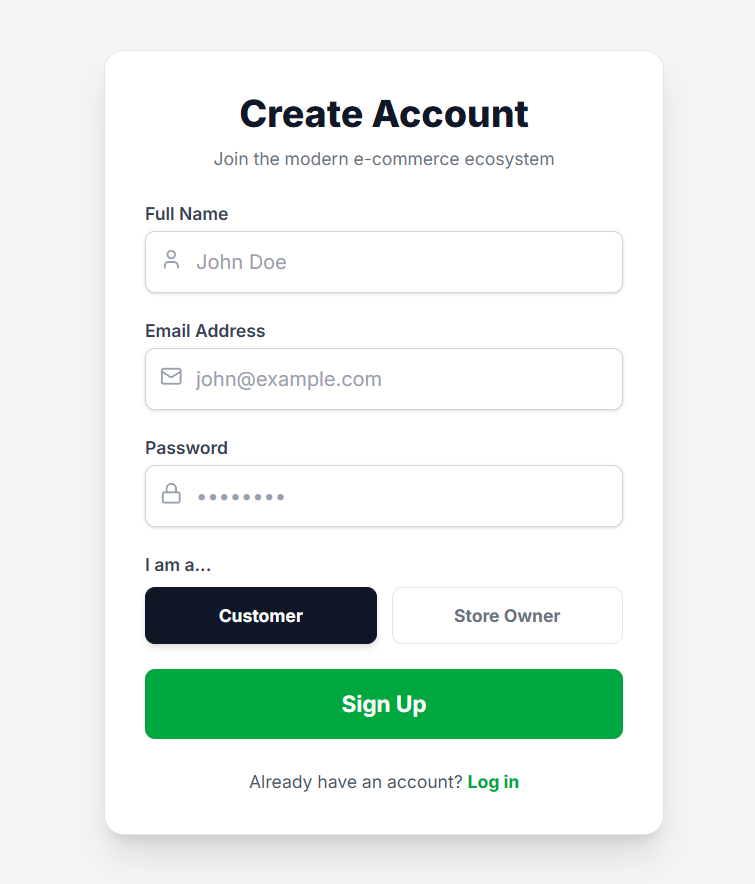
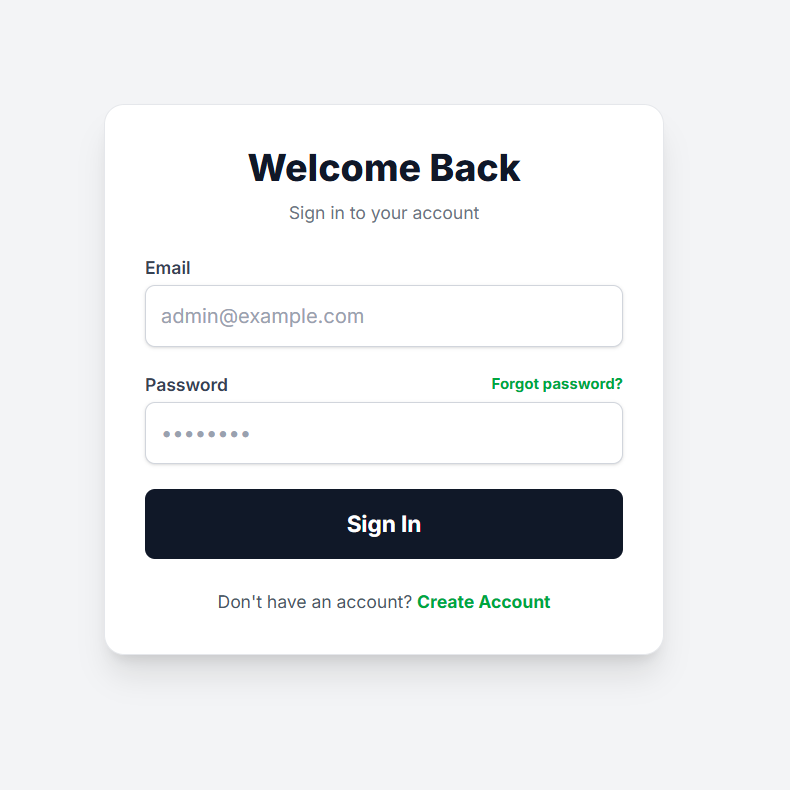
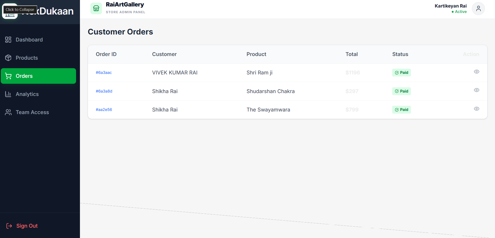
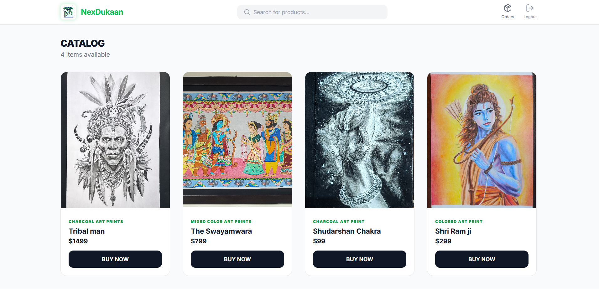
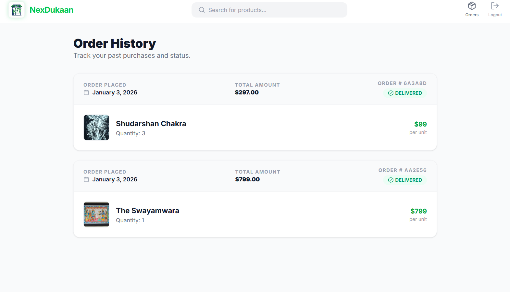

NexDukaan - Modern E-Commerce Platform

NexDukaan is a full-stack, responsive e-commerce application designed with a Monorepo architecture. It features a robust Admin Dashboard for store management and a fast, SEO-optimized Client Shop for customers.
Built with Next.js 15 (App Router) on the frontend and Node.js/Express with MongoDB on the backend.

________________________________________
🚀 Key Features

🛍️ Client Storefront (Public)
•	Static & Fast: Optimized with Next.js Static Generation for SEO and lightning-fast load times.
•	Smart Search: Real-time product filtering using URL parameters (Suspense-optimized).
•	Seamless Checkout: Custom modal-based checkout flow with simulated credit card processing and stock validation.
•	Responsive UI: Fully mobile-responsive design using Tailwind CSS.
•	Order History: Dynamic, secure order tracking for logged-in users.
📊 Admin Dashboard (Private)
•	Store Isolation: Multi-tenant architecture ensuring Admins only see data for their specific store.
•	Smart Sidebar: Collapsible navigation that auto-shrinks on mobile but remains fully interactive.
•	Real-Time Analytics: * Interactive Revenue Trends (Line Charts).
o	Inventory Distribution (Pie/Bar Charts).
o	KPI Tracking (Fulfillment Rate, Avg Order Value).
•	Inventory Management: Add, edit, and track product stock levels. Trigger an alert when stock levels fall below the defined threshold.
•	Export Data: CSV export functionality for financial reporting.
🛡️ Security & Architecture
•	Role-Based Access Control (RBAC): Middleware/Proxy protection protecting /dashboard for Admins and /shop for Clients.
•	Hybrid Rendering: * Static (/shop): For performance.
o	Dynamic (/dashboard, /orders): For real-time private data.
•	Secure Auth: HTTP-only cookie management using nookies.

________________________________________
🛠️ Tech Stack

Frontend
•	Framework: Next.js 15 (App Router)
•	Styling: Tailwind CSS
•	Icons: Lucide React
•	Charts: Recharts
•	HTTP Client: Axios
•	State Management: React Hooks (useState, useEffect, Suspense)
Backend
•	Runtime: Node.js
•	Framework: Express.js
•	Database: MongoDB (Mongoose ODM)
•	Authentication: JSON Web Tokens (JWT)
•	Security: CORS, Helmet, BCrypt

________________________________________
📂 Project Structure

Bash
ECOMM_DASHBOARD/
├── FRONTEND/                 # Next.js Application
│   ├── src/
│   │   ├── app/
│   │   │   ├── (client)/     # Public Shop & User Routes
│   │   │   ├── (dashboard)/  # Protected Admin Routes
│   │   │   └── api/          # Next.js Proxy
│   │   ├── components/       # Reusable UI (Sidebar, Navbar)
│   │   └── lib/              # API Clients & Utilities
│   └── package.json
│
├── BACKEND/                  # Express API
│   ├── models/               # Mongoose Schemas (User, Product, Order)
│   ├── routes/               # API Endpoints
│   ├── middleware/           # Auth & Error Handling
│   └── server.js             # Entry Point
│
└── .gitignore                # Global ignore file

________________________________________
⚡ Getting Started

Prerequisites
•	Node.js (v18+)
•	MongoDB Connection String (Atlas or Local)
1. Installation
Clone the repository:
Bash
git clone https://github.com/yourusername/nexdukaan-ecommerce.git
cd nexdukaan-ecommerce
2. Backend Setup
Navigate to the backend folder and install dependencies:
Bash
cd BACKEND
npm install
Create a .env file in BACKEND/.env:
Code snippet
PORT=5000
MONGO_URI=your_mongodb_connection_string
JWT_SECRET=your_super_secret_key
Start the server:
Bash
npm start
3. Frontend Setup
Open a new terminal, navigate to the frontend folder:
Bash
cd ../FRONTEND
npm install
Create a .env.local file in FRONTEND/.env.local:
Code snippet
# Point this to your local backend for development
NEXT_PUBLIC_API_URL=http://localhost:5000/api
Start the application:
Bash
npm run dev
Visit http://localhost:3000 to see the app.

________________________________________
🚀 Deployment Guide

Frontend (Vercel)
1.	Root Directory: Set to FRONTEND.
2.	Build Command: npm run build
3.	Output Directory: Leave Empty (Default)
4.	Environment Variables:
o	NEXT_PUBLIC_API_URL: https://your-backend.onrender.com/api
Backend (Render/Heroku)
1.	Root Directory: Set to BACKEND.
2.	Build Command: npm install
3.	Start Command: node server.js
4.	Environment Variables: Add MONGO_URI and JWT_SECRET.

________________________________________
📸 Screenshots

Home Page 

Sign-up Page 

Login Page 

Admin Dashboard

  1. Products page 
  2. Oders page 
  3. Analytics page 
  4. Add Admin page 

Shop Page

Order History Page

	
________________________________________
🤝 Contributing

Contributions are welcome! Please follow these steps:
1.	Fork the project.
2.	Create your feature branch (git checkout -b feature/AmazingFeature).
3.	Commit your changes (git commit -m 'Add some AmazingFeature').
4.	Push to the branch (git push origin feature/AmazingFeature).
5.	Open a Pull Request.

