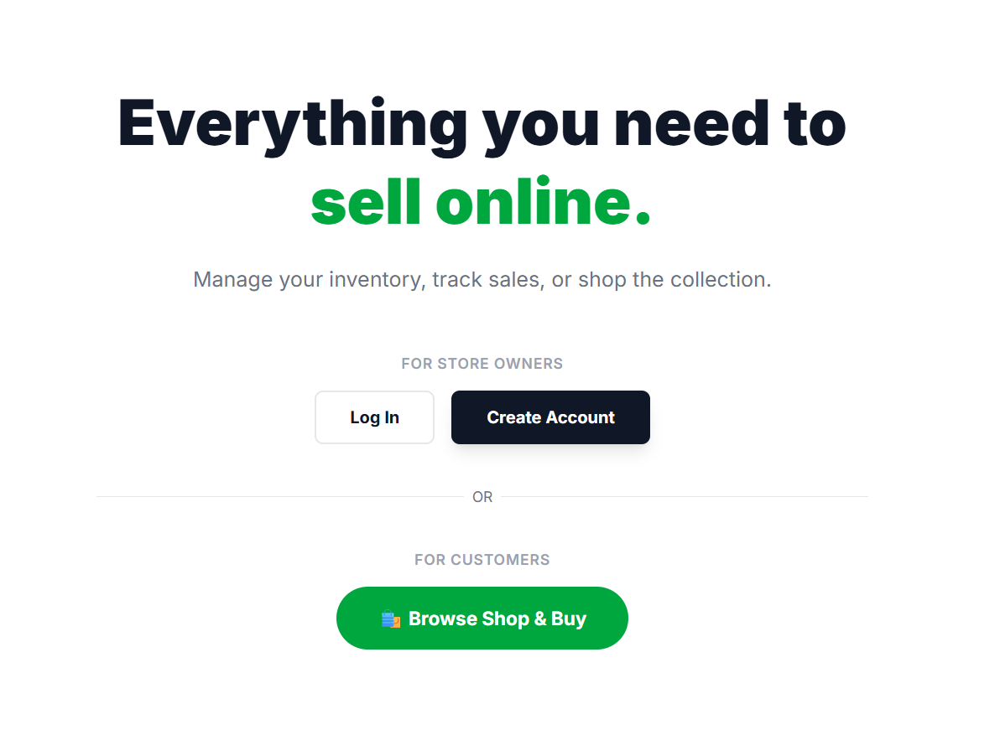
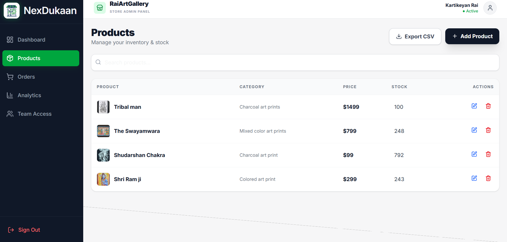
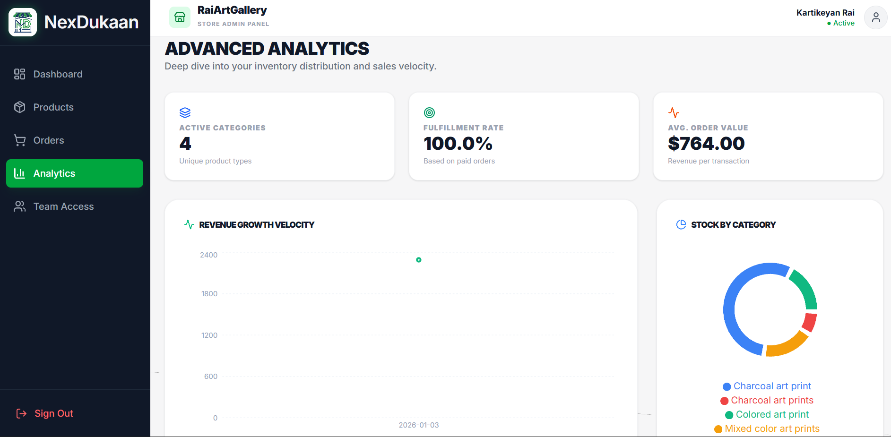
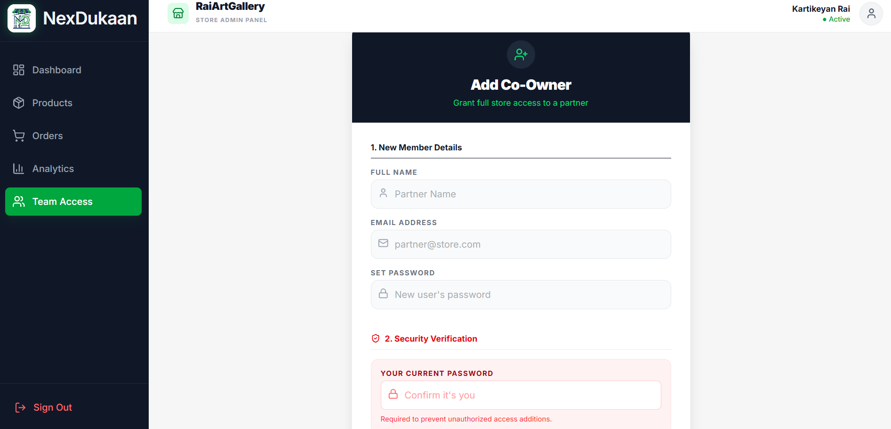

🛒 ## NexDukaan — Modern E-Commerce Platform

 
NexDukaan is a full-stack, responsive e-commerce platform built using a Monorepo architecture.
It includes a powerful Admin Dashboard for store management and a fast, SEO-optimized Client Shop for customers.
Built with Next.js 15 (App Router) on the frontend and Node.js / Express with MongoDB on the backend.

________________________________________
🚀 Key Features

🛍️ Client Storefront (Public)

•	Static & Fast
  o	Optimized using Next.js Static Generation for SEO and ultra-fast load times

•	Smart Search
  o	Real-time product filtering using URL parameters
  o	Suspense-optimized rendering

•	Seamless Checkout
  o	Custom modal-based checkout flow
  o	Simulated credit card processing
  o	Stock validation before order placement

•	Responsive UI
  o	Fully mobile-responsive design with Tailwind CSS

•	Order History
  o	Secure, dynamic order tracking for logged-in users

________________________________________
📊 Admin Dashboard (Private)

•	Store Isolation
  o	Multi-tenant architecture ensures admins access only their store data

•	Smart Sidebar
  o	Collapsible navigation
  o	Auto-shrinks on mobile while remaining fully interactive

•	Real-Time Analytics
  o	Interactive revenue trends (Line Charts)
  o	Inventory distribution (Pie / Bar Charts)
  o	KPI tracking:
    	Fulfillment Rate
    	Average Order Value

•	Inventory Management
  o	Add, edit, and manage product stock
  o	Low-stock alerts when threshold is reached

•	Export Data
  o	CSV export for financial and sales reporting

________________________________________
🛡️ Security & Architecture

•	Role-Based Access Control (RBAC)
  o	Middleware-protected routes:
    	/dashboard → Admins
    	/shop → Clients

•	Hybrid Rendering
  o	Static Routes: /shop (performance-optimized)
  o	Dynamic Routes: /dashboard, /orders (real-time data)

•	Secure Authentication
  o	HTTP-only cookies using nookies
  o	JWT-based authentication

________________________________________
🛠️ Tech Stack

Frontend
  •	Framework: Next.js 15 (App Router)
  •	Styling: Tailwind CSS
  •	Icons: Lucide React
  •	Charts: Recharts
  •	HTTP Client: Axios
  •	State Management: React Hooks (useState, useEffect, Suspense)

Backend
  •	Runtime: Node.js
  •	Framework: Express.js
  •	Database: MongoDB (Mongoose ODM)
  •	Authentication: JSON Web Tokens (JWT)
  •	Security: CORS, Helmet, BCrypt

________________________________________
📂 Project Structure

ECOMM_DASHBOARD/
│
├── FRONTEND/                     # Next.js Application
│   ├── src/
│   │   ├── app/
│   │   │   ├── (client)/         # Public Shop & User Routes
│   │   │   ├── (dashboard)/      # Protected Admin Routes
│   │   │   └── api/              # Next.js Proxy API
│   │   │
│   │   ├── components/           # Reusable UI Components
│   │   │   ├── layout/           # Navbar, Sidebar, Footer
│   │   │   └── ui/               # Buttons, Modals, Cards
│   │   │
│   │   ├── lib/                  # API Clients & Utilities
│   │   ├── hooks/                # Custom React Hooks
│   │   └── styles/               # Global Styles
│   │
│   ├── public/                   # Static Assets
│   ├── package.json
│   └── next.config.js
│
├── BACKEND/                      # Express API
│   ├── models/                   # Mongoose Schemas
│   │   ├── User.js
│   │   ├── Product.js
│   │   └── Order.js
│   │
│   ├── routes/                   # API Endpoints
│   │   ├── auth.routes.js
│   │   ├── product.routes.js
│   │   └── order.routes.js
│   │
│   ├── middleware/               # Auth & Error Handling
│   │   ├── auth.middleware.js
│   │   └── error.middleware.js
│   │
│   ├── config/                   # DB & App Config
│   │   └── db.js
│   │
│   ├── server.js                 # Entry Point
│   └── package.json
│
├── .gitignore                    # Global Ignore File
└── README.md

________________________________________
⚡ Getting Started

Prerequisites
•	Node.js v18+
•	MongoDB connection string (Atlas or Local)

________________________________________
1️⃣ Installation

  git clone https://github.com/yourusername/nexdukaan-ecommerce.git

  cd nexdukaan-ecommerce

________________________________________
2️⃣ Backend Setup

  cd BACKEND

  npm install

  Create a .env file inside BACKEND/:

  PORT=5000

  MONGO_URI=your_mongodb_connection_string

  JWT_SECRET=your secret key

  Start the backend server:

  npm start

________________________________________
3️⃣ Frontend Setup

  cd ../FRONTEND

  npm install

  Create a .env.local file inside FRONTEND/:

  NEXT_PUBLIC_API_URL=http://localhost:5000/api

  Start the frontend:

  npm run dev

  Visit 👉 http://localhost:3000

________________________________________
🚀 Deployment Guide

Frontend (Vercel)

  1.	Root Directory: FRONTEND
  2.	Build Command: npm run build
  3.	Output Directory: Default
  4.	Environment Variables:
  5.	NEXT_PUBLIC_API_URL=https://your-backend.onrender.com/api

________________________________________
Backend (Render / Heroku)

  1.	Root Directory: BACKEND
  2.	Build Command: npm install
  3.	Start Command: node server.js
  4.	Environment Variables:
    o	MONGO_URI
    o	JWT_SECRET
________________________________________
📸 Screenshots

•	Home Page

•	Sign-Up Page

•	Login Page

Client Side
  •	Shop Page
  
  
  •	Order History Page
  
 
Admin Dashboard

 
  1.	Products Page
  
  
  2.	Orders Page
  
  
  3.	Analytics Page
  
  
  4.	Add Admin Page
  

________________________________________
🤝 Contributing

Contributions are welcome!
  1.	Fork the repository

  2.	Create your feature branch

  3.	git checkout -b feature/AmazingFeature

  4.	Commit your changes

  5.	git commit -m "Add AmazingFeature"

  6.	Push to the branch

  7.	git push origin feature/AmazingFeature

  8.	Open a Pull Request

